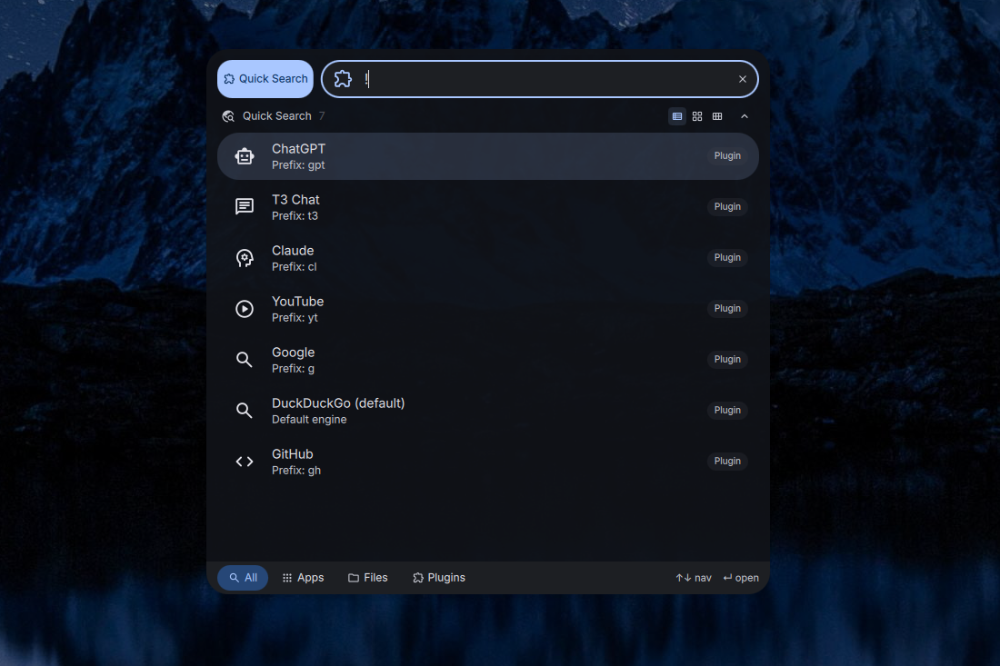

# DankQuickSearch

A minimal launcher plugin for [DankMaterialShell](https://github.com/AvengeMedia/DankMaterialShell) that adds quick web search and AI chat prompts with engine prefixes.



## Features

- Search DuckDuckGo, Google, GitHub, and YouTube from the launcher
- Start browser-based chats with T3 Chat, ChatGPT, and Claude
- Engine prefixes for quick switching (`g`, `gh`, `yt`, `t3`, `gpt`, `cl`)
- Direct URL detection — type a URL to open it
- Configurable default search engine

## Installation

### Nix (flake)

Add as a `flake = false` input and include in your DMS plugin configuration:

```nix
inputs.dms-plugin-quicksearch = {
  url = "github:alcxyz/DankQuickSearch";
  flake = false;
};
```

```nix
programs.dank-material-shell.plugins.dankQuickSearch = {
  enable = true;
  src = inputs.dms-plugin-quicksearch;
};
```

### Manual

Copy the plugin directory to `~/.config/DankMaterialShell/plugins/DankQuickSearch/`.
For an identifiable development build, stage `dist/dev` first and copy
`dist/dev/share/dms-plugins/DankQuickSearch/` instead of the raw checkout.

## Usage

Activate with `!` (default trigger) in the DMS launcher, then:

- `!hello world` — search DuckDuckGo for "hello world"
- `!g hello world` — search Google
- `!gh nix flake` — search GitHub
- `!yt music video` — search YouTube
- `!t3 explain nix flakes` — start a new T3 Chat
- `!gpt explain nix flakes` — start a new ChatGPT chat
- `!cl explain nix flakes` — start a new Claude chat
- `!github.com` — open URL directly

## Requirements

- `xdg-open` (for opening URLs in the default browser)

+## Development builds

The tracked manifest keeps the release version. To stage an identifiable
development package, run:

```bash
python3 scripts/package.py --output dist/dev
```

This produces a manifest version like `X.Y.Z-dev.<commit>`; a dirty checkout
adds `.dirty`. For Nix, use `pkgs.callPackage ./default.nix { revision = ...; }`.
Release packaging is guarded and requires a clean checkout at the exact
`vX.Y.Z` tag.

## License

MIT

<details>
<summary>Support</summary>

- **BTC:** `bc1pzdt3rjhnme90ev577n0cnxvlwvclf4ys84t2kfeu9rd3rqpaaafsgmxrfa`
- **ETH / ERC-20:** `0x2122c7817381B74762318b506c19600fF8B8372c`
</details>
